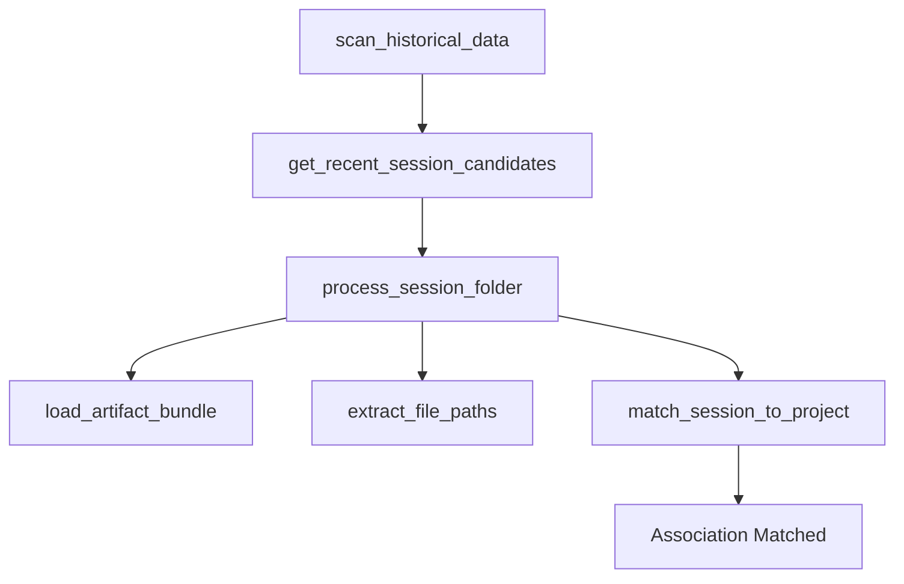

# Serviço: BrainScannerService

O coração do sistema. Analisa os resíduos de execução do Antigravity para reconstruir o contexto de desenvolvimento.

- **Arquivo**: `electron/services/brain_scanner_service.ts`
- **Responsabilidade**: Mineração de dados e associação de sessões.

## 🚀 Funções Principais

### `scan_historical_data(project_filter)`
- **Objetivo**: Ler toda a pasta `brain/` e retornar sessões que dão match com o projeto.
- **Entrada**: Objeto `ProjectMetadata`.
- **Saída**: Array de `AIReasoningSession`.
- **Passo a passo**:
    1. Lista as pastas recentes em `brain/` (limite de 30).
    2. Para cada pasta, chama [[06 - Serviços/BrainScannerService#process_session_folder|process_session_folder()]].
    3. Filtra e ordena as sessões pelo timestamp mais recente.

### `process_session_folder(candidate, project_filter)`
- **Objetivo**: Transformar uma pasta física em um objeto de sessão.
- **Lógica**:
    - Tenta ler `task.md`, `plan.md` e `walkthrough.md`.
    - Coleta o histórico de versões (`.resolved`).
    - Extrai caminhos de arquivos usando [[06 - Serviços/BrainScannerService#extract_file_paths|extract_file_paths()]].
    - Aplica o match de projeto.

### `extract_file_paths(content)`
- **Objetivo**: Encontrar todos os caminhos de arquivos mencionados nos textos.
- **Regex**: Busca padrões `file:///...`, `C:\...`, e caminhos citados entre aspas.
- **Normalização**: Converte todos os caminhos para lowercase e usa backslashes (`\`) para compatibilidade Windows.

## 🛠️ Mapa de Execução Interno

---
[[06 - Serviços/Índice|Voltar para a lista de Serviços]]
